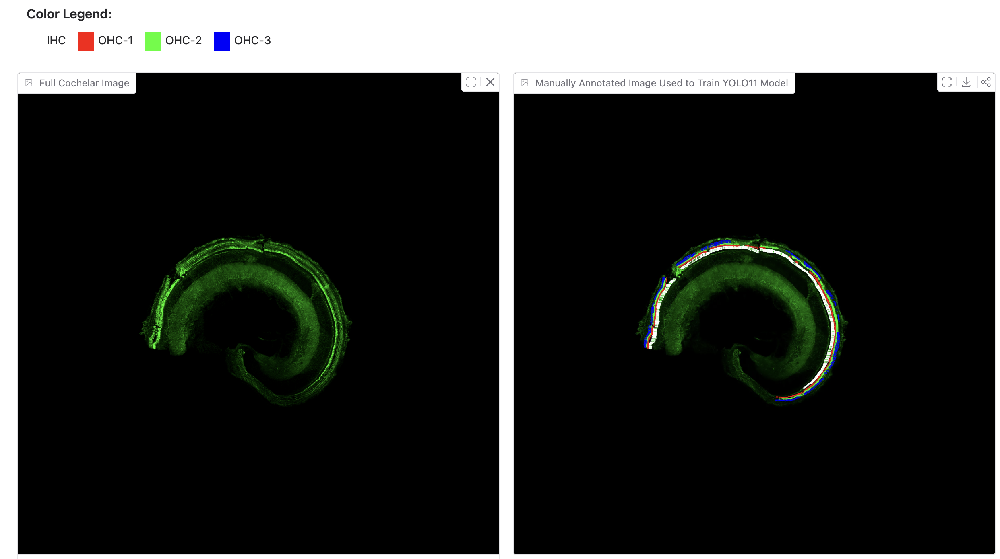

# GANs-YOLO-HC: Hair Cell Detection and Segmentation

**GANs and YOLOv11 for Automated Cochlear Hair Cell Detection**  
*Cole Krudwig, Sara Avila, Ariana Mondiri, Adya Dhuler, Samantha Phillips, Ashlyn Viereck, Kaylee Van Handel, and Steven Fernandes*



---

## Dataset Information

### Download Dataset
The complete YOLOv11 hair cell dataset can be downloaded from:
**[Download YOLO_11_Data_Model.zip](https://www.dropbox.com/scl/fi/hngd0d21nhvet70sxkkcz/YOLO_11_Data_Model.zip?rlkey=jyy134cxwyu549encdlwiueho&st=xc0kah4h&dl=0)**

**What's included in the download:**
- `output_320.zip` - Complete dataset with images and labels
- `best.pt` - Pre-trained YOLOv11 model

### Dataset Structure
The dataset contains:
- **Hair Cell Images**: High-resolution microscopy images of cochlear hair cells
- **YOLO Annotations**: Bounding box annotations for 4 classes of hair cells
- **Training/Test Split**: Pre-organized training and test sets

### Classes
The dataset includes 4 classes of hair cells:
1. **IHC**: Inner Hair Cells
2. **OHC-1**: Outer Hair Cells Row 1
3. **OHC-2**: Outer Hair Cells Row 2
4. **OHC-3**: Outer Hair Cells Row 3

---

## Repository Structure

```
GANs-YOLO-HC/
├── src/
│   ├── GANs_Hair_Cell.ipynb                      # GANs-based hair cell segmentation notebook
│   └── YOLO_v11_Cochlear_Hair_Cell_Detection.ipynb # YOLOv11 training notebook
├── scripts/                         # Python scripts for training and inference
│   ├── train_yolo.py                # YOLOv11 training script
│   ├── inference_yolo.py            # Inference and prediction script
│   └── visualize_results.py         # Results visualization script
├── images/                          # Example images
│   └── image1.png
├── data/                            # Dataset directory
│   └── output_320/                  # Copy your extracted dataset here
│       ├── images/
│       │   ├── Train/               # Training images
│       │   └── Test/                # Test images
│       ├── labels/
│       │   ├── Train/               # Training labels
│       │   └── Test/                # Test labels
│       ├── config.yaml              # Dataset configuration (included in download)
│       └── classes.txt              # Class names (included in download)
├── models/                          # Pre-trained models
│   └── best.pt                      # Copy the pre-trained model here (optional)
├── runs/                            # Training outputs (created during training)
├── results/                         # Inference results
├── requirements.txt                 # Python dependencies
└── README.md                        # Project documentation
```

---

## Quick Start Guide

### 1. Basic Setup
```bash
# Clone repository
git clone https://github.com/ai-research-2025/GANs-YOLO-HC
cd GANs-YOLO-HC

# Install dependencies
pip install -r requirements.txt
```

### 2. Dataset Setup
1. **Download the dataset** from the link above: `YOLO_11_Data_Model.zip`
2. **Extract the files** using your preferred tool (WinRAR, 7-Zip, etc.)
3. **Extract the dataset** and **copy files** to your project:
   ```bash
   # Create directories
   mkdir -p data models
   
   # Extract the output_320.zip file from the downloaded package
   unzip /path/to/extracted/YOLO_11_Data_Model/output_320.zip -d data/
   
   # Copy the pre-trained model
   cp /path/to/extracted/YOLO_11_Data_Model/best.pt models/
   ```

### 3. Training and Inference
```bash
# Train model (or use the provided pre-trained model)
python scripts/train_yolo.py --epochs 100 --batch-size 16

# Run inference
python scripts/inference_yolo.py --model runs/train/yolov11_hair_cells/weights/best.pt --source data/output_320/images/Test/ --batch

# Visualize results
python scripts/visualize_results.py --model runs/train/yolov11_hair_cells/weights/best.pt --test-dir data/output_320/images/Test/ --labels-dir data/output_320/labels/Test/
```

### 4. Using Jupyter Notebooks
```bash
# Start Jupyter and explore the notebooks in src/
jupyter notebook

# Available notebooks:
# - YOLO_v11_Cochlear_Hair_Cell_Detection.ipynb for YOLOv11 training and inference
# - GANs_Hair_Cell.ipynb for GANs-based hair cell segmentation
```

---

## Getting Started

### 1. Environment Setup
```bash
# Clone repository
git clone https://github.com/ai-research-2025/GANs-YOLO-HC
cd GANs-YOLO-HC

# Install dependencies
pip install -r requirements.txt

# Verify installation
python -c "import torch; print('PyTorch version:', torch.__version__)"
python -c "from ultralytics import YOLO; print('YOLO installed successfully')"
```

### 2. Dataset Setup
1. **Download the dataset** from the Dropbox link above
2. **Extract the files** using WinRAR, 7-Zip, or similar tool
3. **Setup the dataset** in your project directory:
   ```bash
   # Create directories
   mkdir -p data models
   
   # Extract the output_320.zip file from the downloaded package
   unzip /path/to/extracted/YOLO_11_Data_Model/output_320.zip -d data/
   
   # Copy the pre-trained model
   cp /path/to/extracted/YOLO_11_Data_Model/best.pt models/
   ```

The dataset structure should look like:
```
data/output_320/
├── images/
│   ├── Train/    # Training images
│   └── Test/     # Test images  
├── labels/
│   ├── Train/    # Training labels
│   └── Test/     # Test labels
├── config.yaml   # Dataset configuration
└── classes.txt   # Class names
```

---

## Example: Setting Up with Downloaded Dataset

After downloading and extracting `YOLO_11_Data_Model.zip`, you'll find:
- `output_320.zip` (dataset archive)
- `best.pt` (pre-trained model)

Here's what your directory should look like after following the setup steps:

```
GANs-YOLO-HC/
├── data/
│   └── output_320/                  # Extracted from output_320.zip
│       ├── images/
│       │   ├── Train/
│       │   │   ├── tile_Dnm3KO_P21_mid_20x_tile_5-5_1280_3840_1600_4160.png
│       │   │   ├── tile_Dnm3KO_P21_mid_20x_tile_5-5_1280_4160_1600_4480.png
│       │   │   └── ... (more training images)
│       │   └── Test/
│       │       ├── tile_Connexin_30_20x_tile_5-5_0_1280_320_1600.png
│       │       ├── tile_Connexin_30_20x_tile_5-5_0_1600_320_1920.png
│       │       └── ... (more test images)
│       ├── labels/
│       │   ├── Train/
│       │   │   ├── tile_Dnm3KO_P21_mid_20x_tile_5-5_1280_3840_1600_4160.txt
│       │   │   └── ... (corresponding label files)
│       │   └── Test/
│       │       ├── tile_Connexin_30_20x_tile_5-5_0_1280_320_1600.txt
│       │       └── ... (corresponding label files)
│       ├── config.yaml
│       └── classes.txt
├── models/
│   └── best.pt                      # Copied from downloaded package
└── ... (other project files)
```

---

## Training

### Option 1: Using Pre-trained Model (Recommended)
The download includes a pre-trained `best.pt` model. After copying it to the `models/` directory:
```bash
# Use the pre-trained model directly for inference
python scripts/inference_yolo.py --model models/best.pt --source data/output_320/images/Test/ --batch
```

### Option 2: Training from Scratch
```bash
# Basic training
python scripts/train_yolo.py

# Training with custom parameters
python scripts/train_yolo.py --epochs 100 --batch-size 16 --model-size l

# Training with validation
python scripts/train_yolo.py --epochs 50 --validate
```

**Training Parameters:**
- `--epochs`: Number of training epochs (default: 100)
- `--batch-size`: Batch size for training (default: 16)
- `--model-size`: YOLOv11 model size: `n`, `s`, `m`, `l`, `x` (default: `l`)

### Option 3: Using Jupyter Notebook
```bash
# Start Jupyter and explore notebooks
jupyter notebook

# Navigate to src/ folder and open:
# - YOLO_v11_Cochlear_Hair_Cell_Detection.ipynb for YOLOv11 training
# - GANs_Hair_Cell.ipynb for GANs implementation

# Follow the notebook cells:
# 1. Install dependencies
# 2. Load dataset
# 3. Train or load pre-trained model
# 4. Run inference
# 5. Visualize results
```

---

## Inference

### Using Pre-trained Model
```bash
# Single image inference
python scripts/inference_yolo.py --model models/best.pt --source test_image.jpg

# Batch processing on test images
python scripts/inference_yolo.py --model models/best.pt --source data/output_320/images/Test/ --batch

# Detailed results with confidence scores
python scripts/inference_yolo.py --model models/best.pt --source data/output_320/images/Test/ --detailed
```

### Using Trained Model
```bash
# If you trained your own model
python scripts/inference_yolo.py --model runs/train/yolov11_hair_cells/weights/best.pt --source data/output_320/images/Test/ --batch
```

### Using Jupyter Notebook
Open the `YOLO_v11_Cochlear_Hair_Cell_Detection.ipynb` notebook in the `src/` folder and run the inference cells to process images interactively.

---

## Results Visualization

### Using Python Scripts
```bash
# Compare predictions with ground truth
python scripts/visualize_results.py --model models/best.pt --test-dir data/output_320/images/Test/ --labels-dir data/output_320/labels/Test/

# Single image visualization
python scripts/visualize_results.py --model models/best.pt --image data/output_320/images/Test/sample_image.png

# If you trained your own model
python scripts/visualize_results.py --model runs/train/yolov11_hair_cells/weights/best.pt --test-dir data/output_320/images/Test/ --labels-dir data/output_320/labels/Test/
```

### Using Jupyter Notebook
The `YOLO_v11_Cochlear_Hair_Cell_Detection.ipynb` notebook in the `src/` folder contains interactive visualization code that:
- Displays side-by-side comparison of ground truth vs predictions
- Uses class-specific colors for different hair cell types:
  - **IHC**: White
  - **OHC-1**: Red
  - **OHC-2**: Green
  - **OHC-3**: Blue

---

## GANs for Hair Cell Segmentation

For GAN-based hair cell segmentation, see the notebooks in the `src/` directory:

```bash
# Navigate to GANs notebook
jupyter notebook src/GANs_Hair_Cell.ipynb

# Navigate to YOLOv11 training notebook
jupyter notebook src/YOLO_v11_Cochlear_Hair_Cell_Detection.ipynb
```

---

## Troubleshooting

### Common Issues

1. **CUDA Out of Memory**
   ```bash
   # Reduce batch size
   python scripts/train_yolo.py --batch-size 8
   ```

2. **Import Errors**
   ```bash
   # Reinstall dependencies
   pip install -r requirements.txt
   ```

3. **Dataset Path Issues**
   - Make sure you copied the `output_320` folder to `data/`
   - Verify the dataset structure matches the expected format

4. **Model Not Found**
   ```bash
   # Check if model exists
   ls -la models/best.pt
   ls -la runs/train/yolov11_hair_cells/weights/best.pt
   ```

### Verification Commands
```bash
# Check GPU availability
python -c "import torch; print('CUDA available:', torch.cuda.is_available())"

# Test YOLO installation
python -c "from ultralytics import YOLO; print('YOLO working')"

# Verify dataset structure
ls -la data/output_320/images/Train/
ls -la data/output_320/labels/Train/
```

---

## Acknowledgements
- [YOLOv11 Repository](https://github.com/THU-MIG/yolov11) - Real-time object detection
- [Ultralytics](https://github.com/ultralytics/ultralytics) - YOLO implementation
- Dr. Richard J. Bellucci Translational Hearing Center at Creighton University for providing cochlear image data
- Hair cell dataset contributors and research collaborators

## Citation
If you use this code or dataset, please cite our work:

```bibtex
@inproceedings{krudwig2025gans,
  author    = {Krudwig, Cole and Avila, Sara and Mondiri, Ariana and Dhuler, Adya and Philips, Samantha and Viereck, Ashlyn and Van Handel, Kaylee and Fernandes, Steven},
  title     = {GANs and YOLOv11 for Automated Cochlear Hair Cell Detection},
  booktitle = {Proceedings of FICTA 2025},
  year      = {2025},
  publisher = {Springer}
}
```

Also cite the original YOLOv11 implementation:

```bibtex
@misc{yolov11,
  title={YOLOv11: Real-Time End-to-End Object Detection},
  author={THU-MIG},
  year={2024},
  howpublished={\url{https://github.com/THU-MIG/yolov11}}
}
```
